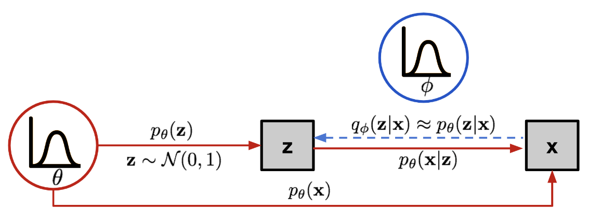

本文从一个初学者的角度介绍扩散模型原理。
# 1.生成模型
首先扩散模型是一类生成模型，近年来因为其一些优秀的性质在各种类型的生成任务上取得了很好的效果。那什么是生成模型呢？字面上来说，生成模型就是一个能够生成样本的模型。比如说针对 $R$ 这个一维空间，我们有一个生成模型 $M$，每次对这个模型采样，我们就能够生成一个一维向量样本 $\boldsymbol{x}$。而生成模型 $M$ 则决定了 $R$ 这个空间中每个点被采样为样本的可能性，即概率分布 $p(\boldsymbol{x})$. 

我们可以看一个简单的生成模型例子，正态分布 $X \sim N(0, 1)$：

$$
p(x) = \frac{1}{\sigma\sqrt{2\pi}} \exp\left(-\frac{(x-\mu)^2}{2\sigma^2}\right) \tag{1.1}
$$

这里我们直接写出了该生成模型概率分布的$p(x)$的解析形式。那么我们如何基于这个解析形式去做样本的采样生成呢？一种最基本的思路是[逆变换采样法](https://zh.wikipedia.org/zh-cn/%E9%80%86%E5%8F%98%E6%8D%A2%E9%87%87%E6%A0%B7),即通过求出概率分布的 $p(x)$ 的累积分布函数 $F(x)$ 再求逆函数得到 $F^{-1}(x)$。然后我们只需要从最简单的$Z \sim U(0, 1)$ 中采样一个$z$, 再进行逆变换即可得到目标样本 $ x = F^{-1}(z)$. 

一般拿到/学到了一个生成模型后，我们主要可以应用它做两个事。1.采样新的样本（即做生成）。2.估计一个样本的可能性（Likelihood）。当然，面对现实中各种复杂的分布（如自然图片），直接对$p(x)$建模是非常困难的，即使我们把这个模型建出来了，直接对这么复杂的模型做逆变换采样也很难做到，因此，我们需要构造一些巧妙的结构来实现生成模型的建模和采样，这个需求推动学术界提出了一系列生成模型，GAN(生成对抗网络)、VAE（变分自编码器）、扩散模型就是其中的几种生成模型建模方式。

# 2.VAE生成模型
VAE（变分自编码器）给出了一种基于Maximum Likelihood（最大化模型对观察到的样本的likelihood估计）进行生成模型建模的方法，并给出了相应的采样方法。既然我们难以直接对$p(x)$进行建模和采样，那么一个相应的想法是：我们能否在一个足够简单的分布 $Z$ 中进行采样，然后让神经网络自己去学如何把 $Z$ 中采样到的每一个样本 $z$ 映射成目标分布中的样本 $x$，从而实现在复杂真实分布 $X$ 中的采样？听起来这个想法挺有道理的，把最难的一步丢给了神经网络，把简单分布的采样留给了自己，而且强迫神经网络在简单的分布和复杂的分布直接建立联系，这就是强迫智能的产生呀（压缩即智能），强迫神经网络从复杂的数据分布中找出本质的简单的规律！但是要怎么基于这个想法去构造一个神经网络的的训练框架呢？这就是VAE要解决的问题。

## 驱动生成模型参数$\theta$优化的目标：最大化证据
首先,驱动生成模型参数$\theta$优化的动力是最大化观察到的样本集 $x^{(i)}$ 的可能性。即最优参数$\theta^{*}$为:
$$ \theta^{*}=\arg \max _{\theta} \prod_{i=1}^{n} p_{\theta}\left(x^{(i)}\right)  \tag{2.1} $$

为了把连乘变成连加（这样子每个单样本在总体优化中占的权重就都一样了），我们把可能性log一下：
$$ \theta^{*}=\arg \max _{\theta} \sum_{i=1}^{n} \log p_{\theta}\left(x^{(i)}\right) \tag{2.2} $$

这里我们把$\log p_{\theta}(x^{(i)})$ 叫做证据（evidence），即观察到的数据的log Likelihood。理论上，我们可以通过如下方式计算$\ p_{\theta}(x^{(i)})$:
$$p_{\theta}\left(\mathbf{x}^{(i)}\right)=\int p_{\theta}\left(\mathbf{x}^{(i)} \mid \mathbf{z}\right) p(\mathbf{z}) d \mathbf{z} = \mathbb{E}_{\mathbf{z} \sim p(\mathbf{z})} p_{\theta}(\mathbf{x^{(i)}} \mid \mathbf{z}) \tag{2.3} $$

即先基于$z$的先验分布$p(z)$采样$z$，再基于条件$z$计算likelihood $p_{\theta}({x}^{(i)} \mid {z})$。但是这样计算实在是太贵了，为了估计一个样本的likelihood需要把所有的$z$都过一遍。（注：不过理论上基于这个公式应该已经能训练一个生成模型了，我们可以把$p(z)$设为标准正态分布，把$\ p_{\theta}(x^{(i)} \mid z)$视为一个确定性映射，称之为probabilistic decoder，用参数为$\theta$的神经网络表示，用随机梯度下降优化$\theta$使得$ - \sum_{i=1}^{n} \log  \mathbb{E}_{\mathbf{z} \sim p(\mathbf{z})} p_{\theta}(x^{(i)} \mid z)$尽可能小即可。有机会可以实现一下试试看，估计收敛会很慢，但应该也会有一定效果。）

## 优化目标的代理：优化证据下界ELBO

既然我们难以直接优化证据使之最大化，那有没有办法设计出一个代理目标函数来间接优化证据呢，答案是有的，而且这种设计方法VAE和diffusion模型都用了，即最大化证据下界（ELBO: Evidence Lower Bound）。只要努力把这个ELBO优化变大，那这个ELBO就会越来越接近真正的证据，同时也让真正的证据越来越大。注意，接下来我们会看到，“越接近真正的证据”和“让真正的证据越来越大”其实对应两个子优化目标。

<figure>  
      
    <figcaption>图1:隐变量z与真实变量x之间的关系 （图源：Lilian Weng: From Autoencoder to Beta-VAE）</figcaption>  
</figure>  

首先如图1所示，参数$\theta$决定了如何基于一个给定的隐变量$z$得到$x$的可能性，即$p_{\theta}(x | z)$（我们称之为probabilistic decoder）。我们提出用一个新的近似函数$q_{\phi}(z | x)$ (我们称之为probabilistic encoder)来近似我们无法直接计算的真实后验分布$p_{\theta}(z | x)$。我们可以用KL散度$D_{\mathrm{KL}}\left(q_{\phi}(\mathbf{z} \mid \mathbf{x}) \mid p_{\theta}(\mathbf{z} \mid \mathbf{x})\right)$来衡量两者间的距离，我们需要优化$\phi$使得这个距离越小越好。接下来我们试着建立证据$\log p_{\theta}(x)$和这个距离之间的联系。展开$\log p_{\theta}(x)$：
$$
\begin{aligned}
\log p_{\theta}(\boldsymbol{x}) & =\log p_{\theta}(\boldsymbol{x}) \int q_{\phi}(\boldsymbol{z} \mid \boldsymbol{x}) d z \\ 
& =\int q_{\phi}(\boldsymbol{z} \mid \boldsymbol{x}) \log p_{\theta}(\boldsymbol{x}) d z \\
& =\mathbb{E}_{q_{\phi}(\boldsymbol{z} \mid \boldsymbol{x})}[\log p_{\theta}(\boldsymbol{x})] \\
& =\mathbb{E}_{q_{\phi}(\boldsymbol{z} \mid \boldsymbol{x})}\left[\log \frac{p_{\theta}(\boldsymbol{x}, \boldsymbol{z})}{p_{\theta}(\boldsymbol{z} \mid \boldsymbol{x})}\right] \\
& =\mathbb{E}_{q_{\phi}(\boldsymbol{z} \mid \boldsymbol{x})}\left[\log \frac{p_{\theta}(\boldsymbol{x}, \boldsymbol{z}) q_{\phi}(\boldsymbol{z} \mid \boldsymbol{x})}{p_{\theta}(\boldsymbol{z} \mid \boldsymbol{x}) q_{\phi}(\boldsymbol{z} \mid \boldsymbol{x})}\right] \\
& =\mathbb{E}_{q_{\phi}(\boldsymbol{z} \mid \boldsymbol{x})}\left[\log \frac{p_{\theta}(\boldsymbol{x}, \boldsymbol{z})}{q_{\phi}(\boldsymbol{z} \mid \boldsymbol{x})}\right]+\mathbb{E}_{q_{\phi}(\boldsymbol{z} \mid \boldsymbol{x})}\left[\log \frac{q_{\phi}(\boldsymbol{z} \mid \boldsymbol{x})}{p_{\theta}(\boldsymbol{z} \mid \boldsymbol{x})}\right] \\
& =\mathbb{E}_{q_{\phi}(\boldsymbol{z} \mid \boldsymbol{x})}\left[\log \frac{p_{\theta}(\boldsymbol{x}, \boldsymbol{z})}{q_{\phi}(\boldsymbol{z} \mid \boldsymbol{x})}\right]+\mathcal{D}_{\mathrm{KL}}\left(q_{\phi}(\boldsymbol{z} \mid \boldsymbol{x}) \| p_{\theta}(\boldsymbol{z} \mid \boldsymbol{x})\right) \\
& \geq \mathbb{E}_{q_{\phi}(\boldsymbol{z} \mid \boldsymbol{x})}\left[\log \frac{p_{\theta}(\boldsymbol{x}, \boldsymbol{z})}{q_{\phi}(\boldsymbol{z} \mid \boldsymbol{x})}\right]
\end{aligned} \tag{2.4}
$$

从公式 (2.4) 我们可以看到，最终的$ \mathbb{E}_{q_{\phi}(\boldsymbol{z} \mid \boldsymbol{x})}\left[\log \frac{p_{\theta}(\boldsymbol{x}, \boldsymbol{z})}{q_{\phi}(\boldsymbol{z} \mid \boldsymbol{x})}\right]
$项和证据$\log p_{\theta}(\boldsymbol{x})$之间就差了一个KL散度$D_{\mathrm{KL}}\left(q_{\phi}(\mathbf{z} \mid \mathbf{x}) \mid p_{\theta}(\mathbf{z} \mid \mathbf{x})\right)$。而由于KL散度永远大于等于零，$ \mathbb{E}_{q_{\phi}(\boldsymbol{z} \mid \boldsymbol{x})}\left[\log \frac{p_{\theta}(\boldsymbol{x}, \boldsymbol{z})}{q_{\phi}(\boldsymbol{z} \mid \boldsymbol{x})}\right]
$一定是证据的下界，即ELBO。同时我们发现，由于证据$\log p_{\theta}(\boldsymbol{x})$相对于$\phi$是个常数（对真实分布的估计怎么变都影响不了真实的分布），我们通过优化$\phi$来最大化ELBO其实就是在最小化KL散度，即尽可能使得ELBO接近真实的证据。其实，优化得足够好的话，就可以用ELBO来估计一个观察到或者生成的样本的likelihood。所以，虽然在实际训练中我们通过同时优化$\phi$和$\theta$来使ELBO变大，优化$\phi$只能让ELBO和证据之间的误差降低，优化$\theta$才能让证据真正变大。

让我们再来展开一下ELBO：
$$
\begin{aligned}
\mathbb{E}_{q_{\phi}(\boldsymbol{z} \mid \boldsymbol{x})}\left[\log \frac{p_{\theta}(\boldsymbol{x}, \boldsymbol{z})}{q_{\phi}(\boldsymbol{z} \mid \boldsymbol{x})}\right] & =\mathbb{E}_{q_{\phi}(\boldsymbol{z} \mid \boldsymbol{x})}\left[\log \frac{p_{\boldsymbol{\theta}}(\boldsymbol{x} \mid \boldsymbol{z}) p(\boldsymbol{z})}{q_{\phi}(\boldsymbol{z} \mid \boldsymbol{x})}\right] \\
& =\mathbb{E}_{q_{\phi}(\boldsymbol{z} \mid \boldsymbol{x})}\left[\log p_{\boldsymbol{\theta}}(\boldsymbol{x} \mid \boldsymbol{z})\right]+\mathbb{E}_{q_{\phi}(\boldsymbol{z} \mid \boldsymbol{x})}\left[\log \frac{p(\boldsymbol{z})}{q_{\phi}(\boldsymbol{z} \mid \boldsymbol{x})}\right] \\
& =\underbrace{\mathbb{E}_{q_{\phi}(\boldsymbol{z} \mid \boldsymbol{x})}\left[\log p_{\boldsymbol{\theta}}(\boldsymbol{x} \mid \boldsymbol{z})\right]}_{\text {reconstruction term }}-\underbrace{\mathcal{D}_{\mathrm{KL}}\left(q_{\phi}(\boldsymbol{z} \mid \boldsymbol{x}) \| p(\boldsymbol{z})\right)}_{\text {prior matching term }} \tag{2.5}
\end{aligned}
$$
可以看到ELBO被分成了两项，且这两项都有相应的易于解释的含义。前一项$\mathbb{E}_{q_{\phi}(\boldsymbol{z} \mid \boldsymbol{x})}\left[\log p_{\boldsymbol{\theta}}(\boldsymbol{x} \mid \boldsymbol{z})\right]$为重建项，表示了在给定一个观察到的样本的情况下，成功重建出该样本的可能性。后一项$\mathcal{D}_{\mathrm{KL}}\left(q_{\phi}(\boldsymbol{z} \mid \boldsymbol{x}) \| p(\boldsymbol{z})\right)$ 为先验匹配项，衡量了probabilistic encoder给出的分布和先验分布之间的差异。

## 具体的优化目标函数
接下来我们来看一下如何通过施加一些假设和技巧，由推导出来的ELBO得出我们具体要优化的目标函数。
首先我们做出以下对分布的假设：
$$
\begin{array}{l}
p(z) \equiv \mathcal{N}(0, I) \\
p_{\theta}(x \mid z) \equiv \mathcal{N}(f_{\theta}(z), c I) \quad f_{\theta} \in F \quad c>0 \\
q_{\phi}(z \mid x) \equiv \mathcal{N}(\mu_{\phi}(x), \sigma_{\phi}(x)) \quad \mu_{\phi} \in G \quad \sigma_{\phi} \in H
\end{array} \tag{2.6}
$$

即：
- 1. $p(z)$ 是标准正态分布。
- 2. $p_{\theta}(x \mid z)$ 是一个均值由$z$决定，协方差矩阵为为正常数c乘以Identity矩阵的正态分布。
- 3. $q_{\phi}(z \mid x)$ 是一个均值和协方差矩阵都由$x$决定的正态分布。此外，为了减少参数量，我们假设协方差矩阵$h_{\phi}(x)$是一个对角协方差矩阵（变量独立性假设）。
  
可以看到，这里我们其实做了很多关于正态分布假设，降低了模型的拟合能力，但是我们也因此在接下来的推导中享受到了正态分布带来的一系列优良性质。基于以上假设我们可以得到如下优化目标函数：

$$
\begin{array}{l}
\underset{\boldsymbol{\phi}, \boldsymbol{\theta}}{\arg \max } \mathbb{E}_{q_{\phi}(\boldsymbol{z} \mid \boldsymbol{x})}\left[\log p_{\boldsymbol{\theta}}(\boldsymbol{x} \mid \boldsymbol{z})\right]-\mathcal{D}_{\mathrm{KL}}\left(q_{\boldsymbol{\phi}}(\boldsymbol{z} \mid \boldsymbol{x}) \| p(\boldsymbol{z})\right) \\
 = \underset{\boldsymbol{\phi}, \boldsymbol{\theta}}{\arg \max } \mathbb{E}_{q_{\phi}(\boldsymbol{z} \mid \boldsymbol{x})}\left(-\frac{\|x-f_{\theta}(z)\|^{2}}{2 c}\right) -\mathcal{D}_{\mathrm{KL}}\left(q_{\boldsymbol{\phi}}(\boldsymbol{z} \mid \boldsymbol{x}) \| p(\boldsymbol{z})\right) \\
 = \underset{\boldsymbol{\phi}, \boldsymbol{\theta}}{\arg \min } \mathbb{E}_{q_{\phi}(\boldsymbol{z} \mid \boldsymbol{x})}\left(\frac{\|x-f_{\theta}(z)\|^{2}}{2 c}\right) + \mathcal{D}_{\mathrm{KL}}\left(q_{\boldsymbol{\phi}}(\boldsymbol{z} \mid \boldsymbol{x}) \| p(\boldsymbol{z})\right) \\
\end{array} \tag{2.7}
$$

从上式我们可以看到$c$这个常数实际上控制了重建项和先验匹配项之间的权重，$c$越大，代表probabilistic decoder的不确定性越大，则重建项的比重相对更小。

在下式中我们通过蒙特卡洛采样估计期望项，其中$L$为采样次数，$z^{l}$为第L次采样得到的值。
$$
\begin{array}{l}
 \underset{\boldsymbol{\phi}, \boldsymbol{\theta}}{\arg \min } \mathbb{E}_{q_{\phi}(\boldsymbol{z} \mid \boldsymbol{x})}\left(\frac{\|x-f_{\theta}(z)\|^{2}}{2 c}\right) + \mathcal{D}_{\mathrm{KL}}\left(q_{\boldsymbol{\phi}}(\boldsymbol{z} \mid \boldsymbol{x}) \| p(\boldsymbol{z})\right) \\
\approx \underset{\phi, \boldsymbol{\theta}}{\arg \min } \sum_{l=1}^{L} \frac{1}{L} \left(\frac{\|x-f_{\theta}(z^{l})\|^{2}}{2 c}\right)+\mathcal{D}_{\mathrm{KL}}\left(q_{\boldsymbol{\phi}}(\boldsymbol{z} \mid \boldsymbol{x}) \| p(\boldsymbol{z})\right)
\end{array} \tag{2.8}
$$

这里我们需要注意的一点是，由于采样操作是不可微分的，我们需要用到重参数化技巧来让梯度能从$z^{l}$传回到$\phi$。也就是说，我们通过改写$z$的采样计算方式来使得$z$和$\boldsymbol{\mu}_{\phi}$、$\boldsymbol{\sigma}_{\phi}$之间关系可微，如下所示（其中$\odot$指逐项相乘）：
$$
\boldsymbol{z}=\boldsymbol{\mu}_{\phi}(\boldsymbol{x})+\boldsymbol{\sigma}_{\phi}(\boldsymbol{x}) \odot \boldsymbol{\epsilon} \quad \text { with } \boldsymbol{\epsilon} \sim \mathcal{N}(\boldsymbol{\epsilon} ; \mathbf{0}, \mathbf{I})
$$

最后，我们推导KL散度的具体计算方式：

$$
\begin{array}{l}
\mathcal{D}_{\mathrm{KL}}\left(q_{\boldsymbol{\phi}}(\boldsymbol{z} \mid \boldsymbol{x}) \| p(\boldsymbol{z})\right) \\
= \mathcal{D}_{\mathrm{KL}}\left(\mathcal{N}\left(\mu, \sigma^{2}\right) \| \mathcal{N}(0,1)\right) \\
= \int \frac{1}{\sqrt{2 \pi \sigma^{2}}} e^{-(x-\mu)^{2} / 2 \sigma^{2}}\left(\log \frac{e^{-(x-\mu)^{2} / 2 \sigma^{2} / \sqrt{2 \pi \sigma^{2}}}}{e^{-x^{2} / 2} / \sqrt{2 \pi}}\right) d x \\
= \int \frac{1}{\sqrt{2 \pi \sigma^{2}}} e^{-(x-\mu)^{2} / 2 \sigma^{2}} \log \left\{\frac{1}{\sqrt{\sigma^{2}}} \exp \left\{\frac{1}{2}\left[x^{2}-(x-\mu)^{2} / \sigma^{2}\right]\right\}\right\} d x \\
= \frac{1}{2} \int \frac{1}{\sqrt{2 \pi \sigma^{2}}} e^{-(x-\mu)^{2} / 2 \sigma^{2}}\left[-\log \sigma^{2}+x^{2}-(x-\mu)^{2} / \sigma^{2}\right] d x
\end{array}
$$

整个结果分为三项积分，第一项实际上就是 $−\log\sigma^{2}$ 乘以概率密度的积分（也就是 1），所以结果是 $−\log\sigma^{2}$；第二项实际是正态分布的二阶矩，正态分布的二阶矩为 $\mu^2+\sigma^2$；而根据方差的定义定义，第三项实际上就是“-方差除以方差=-1”。所以总结果就是：
$$
\begin{array}{l}
\mathcal{D}_{\mathrm{KL}}\left(q_{\boldsymbol{\phi}}(\boldsymbol{z} \mid \boldsymbol{x}) \| p(\boldsymbol{z})\right) \\
= \frac{1}{2}\left(-\log \sigma_{\phi}^{2}+\mu_{\phi}^{2}+\sigma_{\phi}^{2}-1\right)
\end{array}
$$

至此，整个目标函数都被具体表达出来了，基于它去优化用神经网络表示的 $\mu_{\phi}$， $\sigma_{\phi}$ 和 $f_{\theta}$ 就行啦。

# 3.扩散模型

---------
# 参考文献
[1] [From Autoencoder to Beta-VAE](https://lilianweng.github.io/posts/2018-08-12-vae/) by Lilian Weng
[2] [What are Diffusion Models?](https://lilianweng.github.io/posts/2021-07-11-diffusion-models/#nice) by Lilian Weng
[3] [Understanding Diffusion Models: A Unified Perspective](https://calvinyluo.com/2022/08/26/diffusion-tutorial.html) by Calvin Luo
[4] [Understanding Variational Autoencoders (VAEs)](https://towardsdatascience.com/understanding-variational-autoencoders-vaes-f70510919f73) by Joseph Rocca
[5] [Understanding Diffusion Probabilistic Models (DPMs)](https://towardsdatascience.com/understanding-variational-autoencoders-vaes-f70510919f73) by Joseph Rocca
[6] Diederik P. Kingma, and Max Welling. [“Auto-encoding variational bayes.”](https://arxiv.org/pdf/1312.6114) ICLR 2014.
[7] [变分自编码器VAE：原来是这么一回事](https://zhuanlan.zhihu.com/p/34998569) by 苏剑林
[8] [生成扩散模型(一): 基础 (Generative Diffusion Model: Basic)](https://www.jarvis73.com/2022/08/08/Diffusion-Model-1/) by 张建伟

比如如果我们把
$$ p(x) = \frac{p(x｜z)p(z)}{p(z｜x)} \tag{2} $$